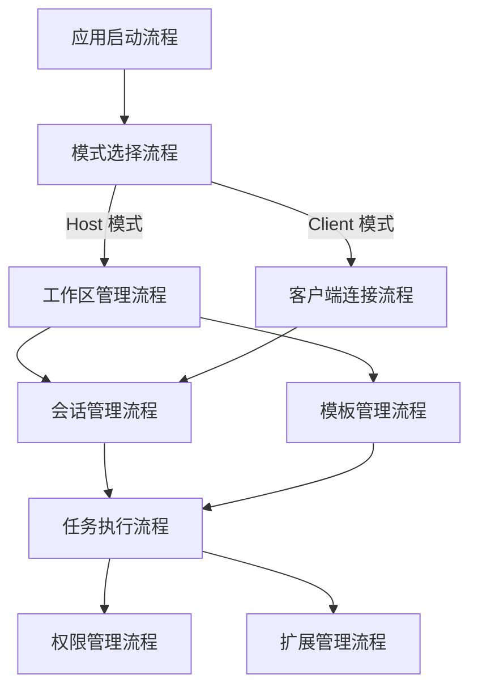
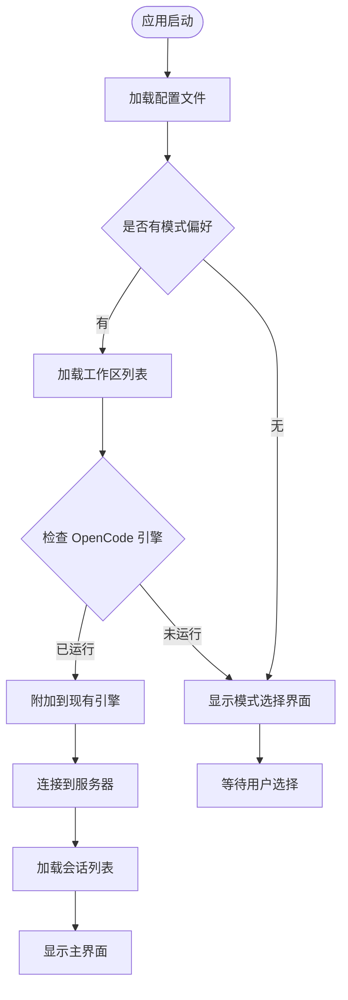
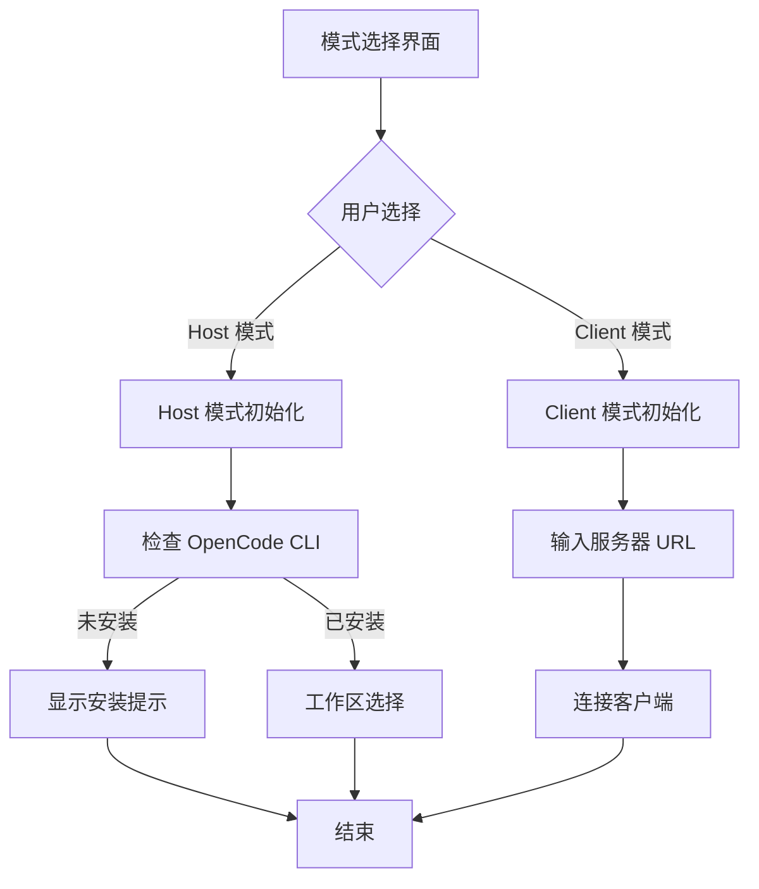
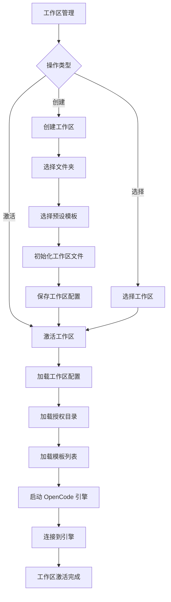
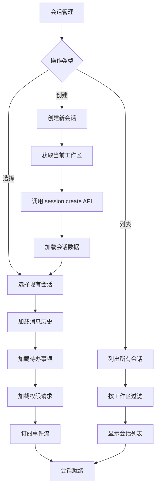
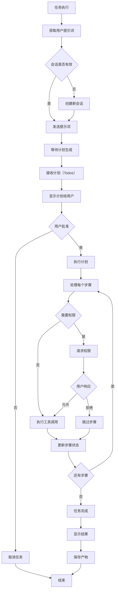
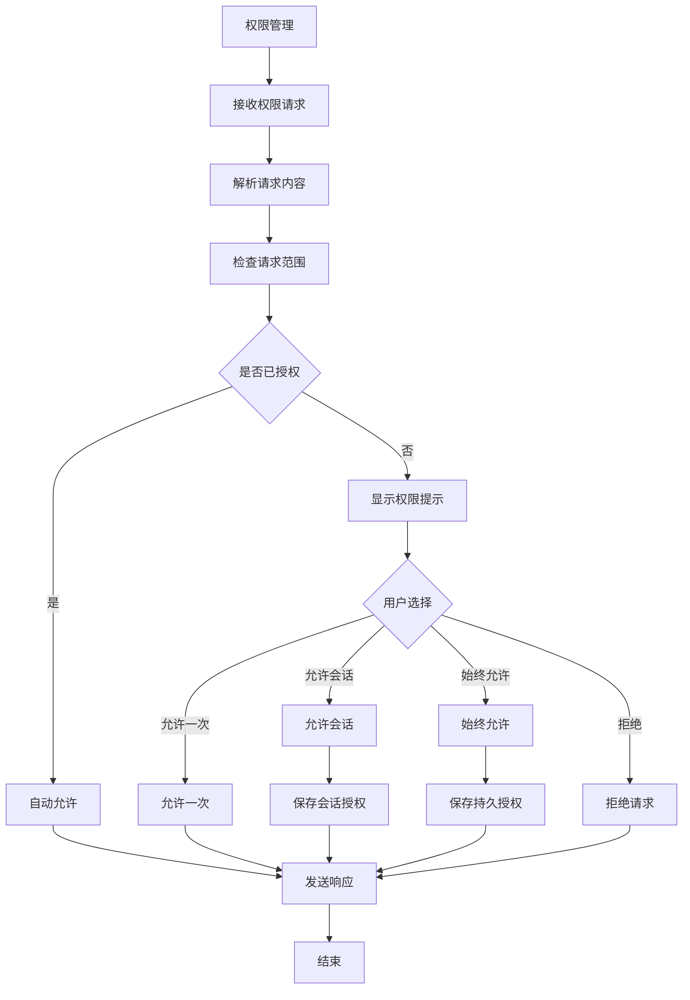
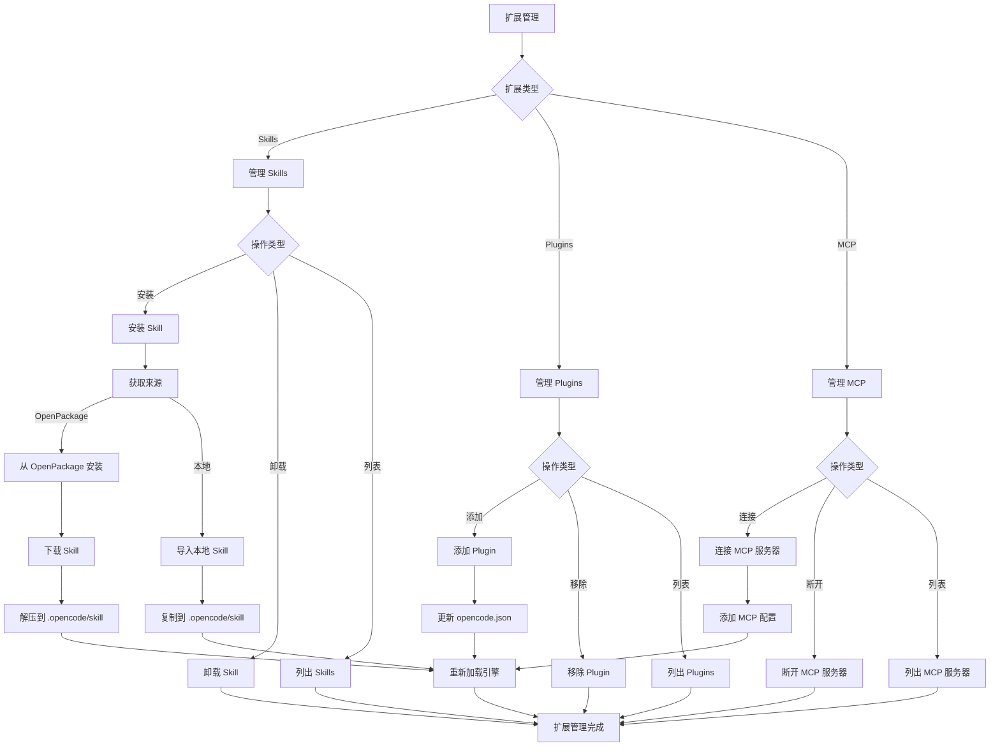
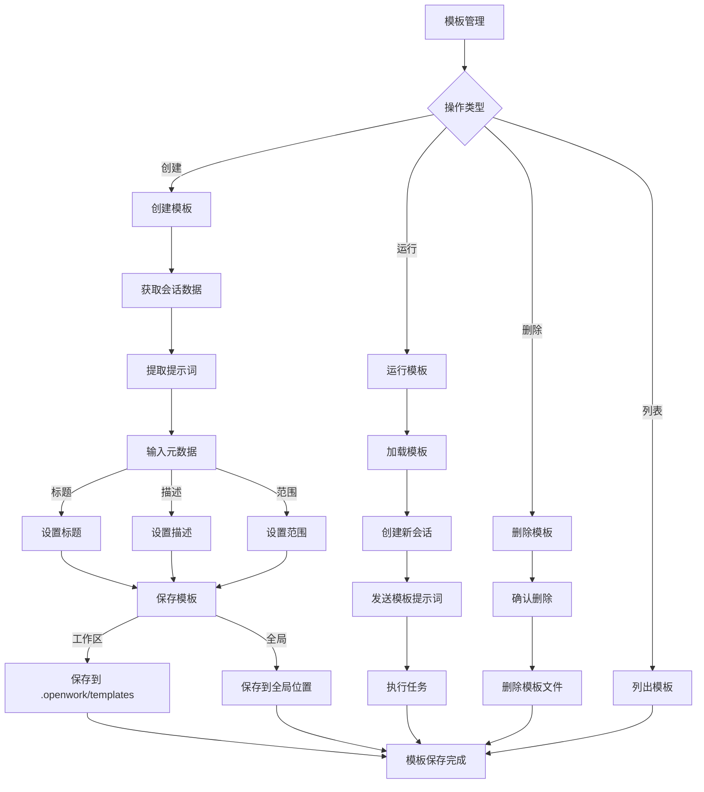

# OpenWork 处理流程图

## 流程图模块

### 模块关系图



**模块说明**：
- **应用启动流程**：初始化应用，加载配置和状态
- **模式选择流程**：选择 Host 模式（本地运行）或 Client 模式（连接远程服务器）
- **工作区管理流程**：创建、选择、激活工作区，管理授权目录
- **客户端连接流程**：连接到远程 OpenCode 服务器
- **会话管理流程**：创建、选择、管理会话
- **任务执行流程**：执行 AI 任务，处理提示词、计划、执行和结果
- **权限管理流程**：处理权限请求，管理授权范围
- **扩展管理流程**：管理 Skills、Plugins、MCP 等扩展
- **模板管理流程**：创建、保存、运行模板

### 1. 应用启动流程

**职责**：初始化应用，加载配置和状态

**输入**：应用启动  
**输出**：进入模式选择或直接进入主界面



### 2. 模式选择流程

**职责**：选择运行模式（Host 或 Client）

**输入**：用户选择模式  
**输出**：进入相应模式的初始化流程



### 3. 工作区管理流程

**职责**：管理工作区（创建、选择、激活）

**输入**：工作区操作请求  
**输出**：激活的工作区



### 4. 会话管理流程

**职责**：创建、选择、管理会话

**输入**：会话操作请求  
**输出**：选中的会话



### 5. 任务执行流程

**职责**：执行 AI 任务，处理提示词、计划、执行和结果

**输入**：用户提示词  
**输出**：任务执行结果



### 6. 权限管理流程

**职责**：处理权限请求，管理授权范围

**输入**：权限请求  
**输出**：权限决策



### 7. 扩展管理流程

**职责**：管理 Skills、Plugins、MCP 等扩展

**输入**：扩展操作请求  
**输出**：扩展状态更新



### 8. 模板管理流程

**职责**：创建、保存、运行模板

**输入**：模板操作请求  
**输出**：模板状态更新



## 核心设计逻辑

### 1. 工作区管理机制
- **工作区即文件夹**：每个工作区对应一个文件夹路径
- **配置文件**：工作区配置保存在 `.openwork/openwork.json`
- **授权目录**：每个工作区维护授权目录列表，限制访问范围
- **预设模板**：支持 starter、custom 等预设模板

### 2. 会话管理机制
- **会话即任务**：每个会话对应一个 AI 任务执行上下文
- **会话隔离**：不同会话之间的状态和权限相互独立
- **会话持久化**：会话数据保存在 OpenCode 服务器端
- **事件流订阅**：通过 SSE 实时接收会话更新

### 3. 任务执行机制
- **提示词驱动**：用户输入提示词，AI 生成执行计划
- **计划预览**：执行前显示计划（Todos），用户可批准或取消
- **步骤执行**：按计划逐步执行，每个步骤可能涉及工具调用
- **权限检查**：每个步骤执行前检查所需权限
- **实时更新**：通过事件流实时更新执行状态和结果

### 4. 权限管理机制
- **最小权限原则**：默认拒绝，需要明确授权
- **权限级别**：
  - **允许一次**：仅当前操作有效
  - **允许会话**：当前会话内有效
  - **始终允许**：持久授权，跨会话有效
- **权限范围**：基于授权目录列表，限制文件系统访问
- **权限审计**：记录所有权限决策，便于审计

### 5. 扩展管理机制
- **Skills**：存储在 `.opencode/skill` 目录，通过 OpenPackage 安装
- **Plugins**：配置在 `opencode.json` 的 `plugin` 字段
- **MCP**：配置在 `opencode.json` 的 `mcp` 字段
- **热重载**：扩展变更后需要重新加载引擎才能生效

### 6. 模板管理机制
- **模板格式**：支持 Markdown frontmatter 或 JSON 格式
- **模板范围**：
  - **工作区模板**：保存在 `.openwork/templates`，仅当前工作区可用
  - **全局模板**：保存在全局位置，所有工作区可用
- **模板内容**：包含标题、描述、提示词等元数据
- **模板运行**：运行模板时创建新会话并发送模板提示词

## 关键代码位置（Python 实现）

### 应用启动和模式选择
- **应用入口**: `src/main.py` - `main()` 函数
- **模式选择**: `src/app.py` - `App.select_mode()` 方法
- **配置加载**: `src/config.py` - `Config.load()` 方法

### 工作区管理
- **工作区存储**: `src/workspace/store.py` - `WorkspaceStore` 类
- **工作区创建**: `src/workspace/manager.py` - `WorkspaceManager.create()` 方法
- **工作区激活**: `src/workspace/manager.py` - `WorkspaceManager.activate()` 方法
- **授权目录管理**: `src/workspace/manager.py` - `WorkspaceManager.manage_authorized_dirs()` 方法

### 引擎管理
- **引擎检查**: `src/engine/doctor.py` - `EngineDoctor.check()` 方法
- **引擎启动**: `src/engine/manager.py` - `EngineManager.start()` 方法
- **引擎停止**: `src/engine/manager.py` - `EngineManager.stop()` 方法
- **引擎信息**: `src/engine/manager.py` - `EngineManager.info()` 方法

### 客户端连接
- **客户端创建**: `src/client/opencode.py` - `OpenCodeClient.create()` 方法
- **健康检查**: `src/client/opencode.py` - `OpenCodeClient.health()` 方法
- **连接管理**: `src/client/manager.py` - `ClientManager.connect()` 方法

### 会话管理
- **会话创建**: `src/session/manager.py` - `SessionManager.create()` 方法
- **会话选择**: `src/session/manager.py` - `SessionManager.select()` 方法
- **会话列表**: `src/session/manager.py` - `SessionManager.list()` 方法
- **消息加载**: `src/session/manager.py` - `SessionManager.load_messages()` 方法
- **事件订阅**: `src/session/events.py` - `EventSubscriber.subscribe()` 方法

### 任务执行
- **提示词发送**: `src/session/manager.py` - `SessionManager.send_prompt()` 方法
- **计划处理**: `src/task/planner.py` - `TaskPlanner.process_plan()` 方法
- **步骤执行**: `src/task/executor.py` - `TaskExecutor.execute_step()` 方法
- **结果处理**: `src/task/executor.py` - `TaskExecutor.process_result()` 方法

### 权限管理
- **权限请求处理**: `src/permission/manager.py` - `PermissionManager.handle_request()` 方法
- **权限决策**: `src/permission/manager.py` - `PermissionManager.decide()` 方法
- **权限存储**: `src/permission/store.py` - `PermissionStore` 类
- **权限响应**: `src/permission/manager.py` - `PermissionManager.respond()` 方法

### 扩展管理
- **Skills 管理**: `src/extensions/skills.py` - `SkillsManager` 类
  - `install_from_opkg()`: 从 OpenPackage 安装
  - `import_local()`: 导入本地 Skill
  - `list()`: 列出已安装的 Skills
- **Plugins 管理**: `src/extensions/plugins.py` - `PluginsManager` 类
  - `add()`: 添加 Plugin
  - `remove()`: 移除 Plugin
  - `list()`: 列出已配置的 Plugins
- **MCP 管理**: `src/extensions/mcp.py` - `McpManager` 类
  - `connect()`: 连接 MCP 服务器
  - `disconnect()`: 断开 MCP 服务器
  - `list()`: 列出已配置的 MCP 服务器

### 模板管理
- **模板创建**: `src/templates/manager.py` - `TemplateManager.create()` 方法
- **模板保存**: `src/templates/manager.py` - `TemplateManager.save()` 方法
- **模板加载**: `src/templates/manager.py` - `TemplateManager.load()` 方法
- **模板运行**: `src/templates/manager.py` - `TemplateManager.run()` 方法
- **模板列表**: `src/templates/manager.py` - `TemplateManager.list()` 方法

### 工具函数
- **配置读写**: `src/utils/config.py` - 配置文件读写工具
- **文件操作**: `src/utils/files.py` - 文件系统操作工具
- **路径处理**: `src/utils/paths.py` - 路径处理工具（使用 pathlib）
- **异步工具**: `src/utils/async.py` - 异步操作工具

## 数据流

### 工作区数据流
```
用户选择文件夹 → 创建工作区 → 初始化配置文件 → 保存工作区状态 → 激活工作区 → 加载配置 → 启动引擎
```

### 会话数据流
```
创建会话 → 发送提示词 → 接收计划 → 用户批准 → 执行步骤 → 接收更新 → 显示结果 → 保存产物
```

### 权限数据流
```
工具调用需要权限 → 检查授权状态 → 未授权则请求 → 用户决策 → 保存决策 → 发送响应 → 继续执行
```

### 扩展数据流
```
安装扩展 → 更新配置 → 重新加载引擎 → 扩展生效 → 工具可用
```

## 状态管理

### 应用状态
- **当前模式**：Host 或 Client
- **当前工作区**：激活的工作区 ID
- **当前会话**：选中的会话 ID
- **引擎状态**：运行中、已停止、错误

### 工作区状态
- **工作区列表**：所有已创建的工作区
- **授权目录**：当前工作区的授权目录列表
- **模板列表**：当前工作区的模板列表

### 会话状态
- **会话列表**：当前工作区的所有会话
- **消息历史**：当前会话的消息列表
- **待办事项**：当前会话的计划（Todos）
- **权限请求**：当前会话的待处理权限请求

### 扩展状态
- **Skills 列表**：已安装的 Skills
- **Plugins 列表**：已配置的 Plugins
- **MCP 列表**：已配置的 MCP 服务器
