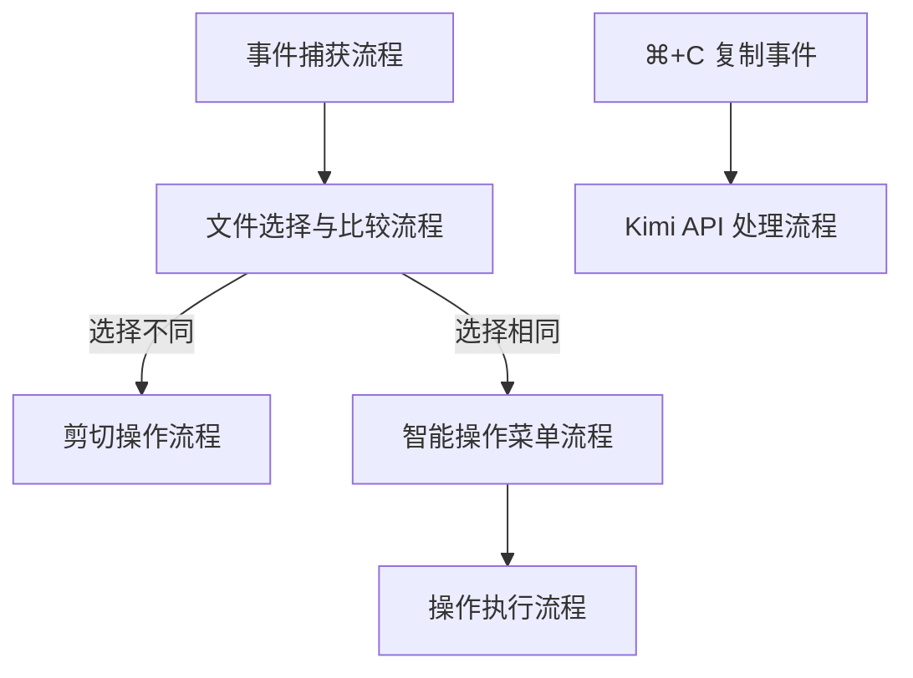
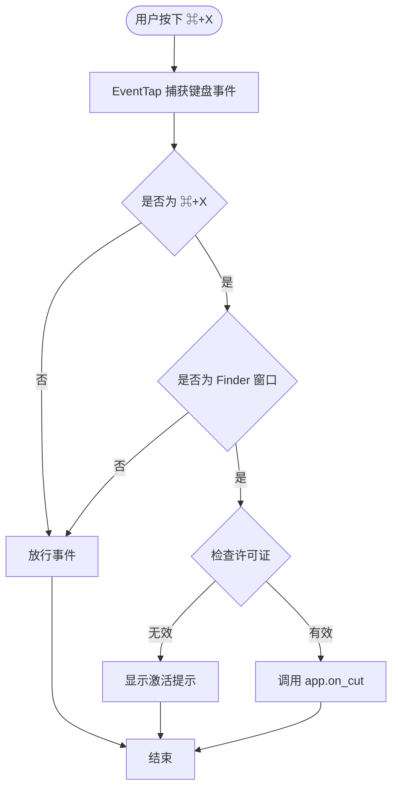
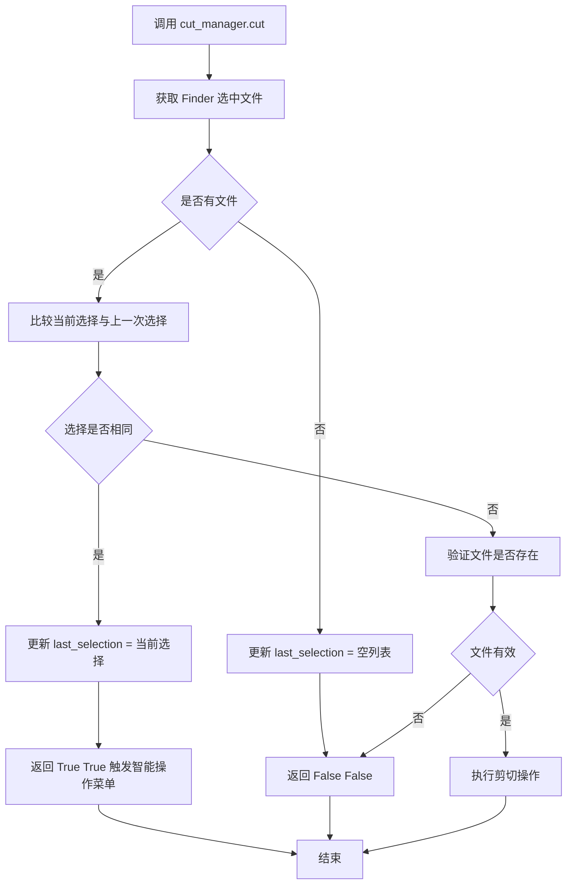
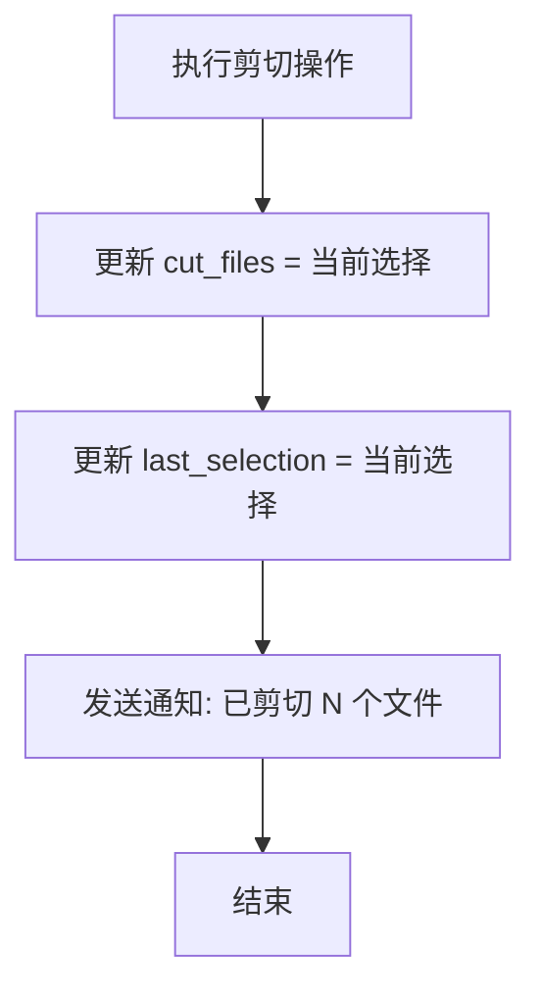
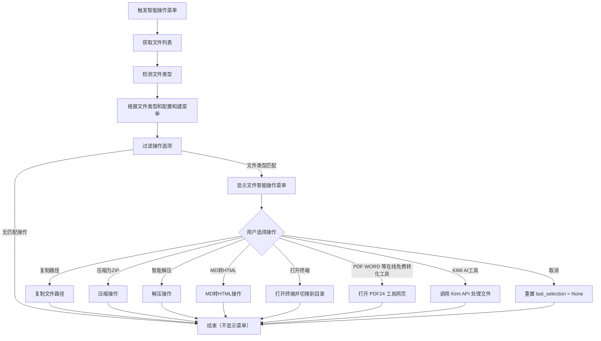
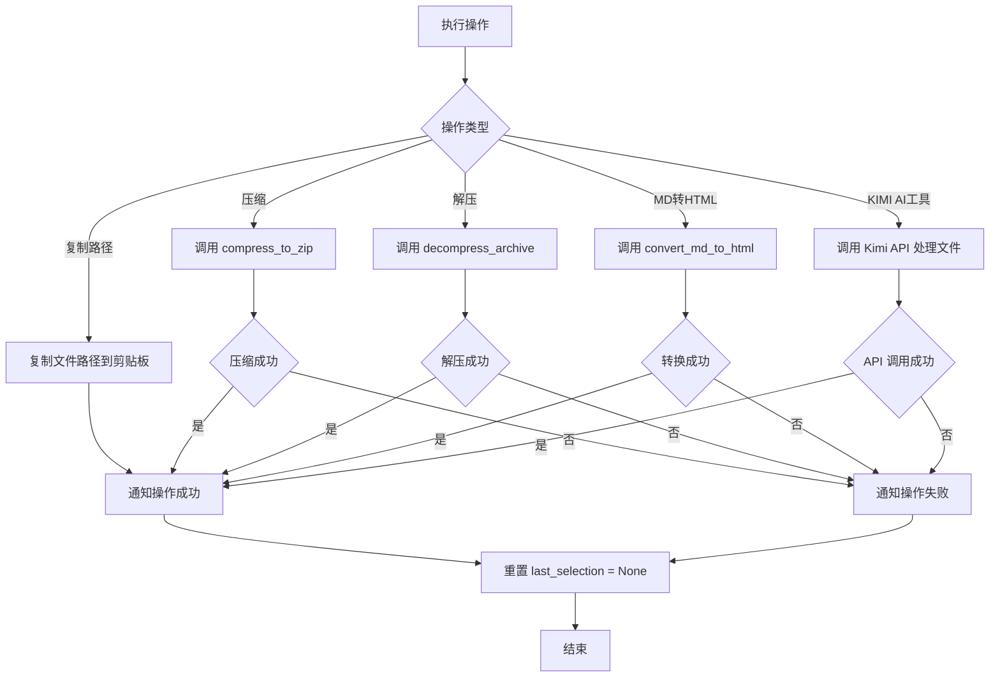
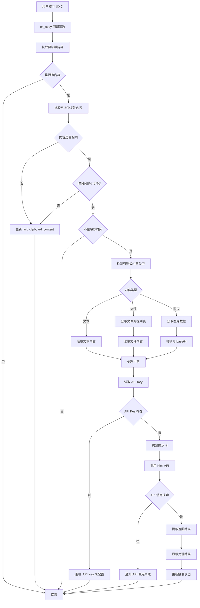

# CommondX 处理流程图

## 流程图模块

### 模块关系图



**模块说明**：
- **事件捕获流程**：系统级事件处理，验证快捷键、窗口和许可证
- **文件选择与比较流程**：业务逻辑核心，决定执行路径
- **剪切操作流程**：执行文件剪切，更新状态
- **智能操作菜单流程**：用户交互界面，显示操作选项
- **操作执行流程**：执行具体文件操作，处理结果
- **Kimi API 处理流程**：AI 功能，处理剪贴板内容（文本/文件/图片），支持翻译、解释、分析等

### 1. 事件捕获流程

**职责**：捕获和处理键盘事件，验证快捷键、窗口和许可证

**输入**：系统键盘事件  
**输出**：调用业务逻辑或放行事件



### 2. 文件选择与比较流程

**职责**：获取文件选择，比较与上次选择，决定执行路径

**输入**：调用 `cut_manager.cut()`  
**输出**：返回 `(bool, bool)` 或执行剪切操作



### 3. 剪切操作流程

**职责**：执行剪切操作，更新状态，发送通知

**输入**：已验证的文件列表  
**输出**：更新 cut_files 和 last_selection，发送通知



### 4. 智能操作菜单流程

**职责**：显示智能操作菜单，处理用户选择

**输入**：触发菜单显示（选择相同）  
**输出**：用户选择的操作类型



### 5. 操作执行流程

**职责**：执行具体的文件操作，处理结果，重置状态

**输入**：操作类型和文件列表  
**输出**：操作结果通知，重置 last_selection



### 6. Kimi API 处理流程

**职责**：处理剪贴板内容，调用 AI API 进行翻译、解释、分析等操作

**输入**：⌘+C 复制事件  
**输出**：AI 处理结果（翻译、解释、总结、分析）



## 核心设计逻辑

### 1. 选择比较机制
- 使用 `set()` 比较文件列表，忽略顺序
- 空列表 `[]` 和 `None` 被视为相同（都是空选择）
- 比较结果决定是执行剪切还是显示智能操作菜单

### 2. 处理规则
- **选择与上次不同**：执行剪切，更新 `cut_files` 和 `last_selection`
- **选择与上次相同**：触发智能操作菜单，更新 `last_selection`
- **没有文件**：返回 `(False, False)`，更新 `last_selection = []`
- **文件不存在**：即使选择相同，如果文件不存在，也返回 `(False, False)`，不显示菜单

### 3. 状态管理
- **last_selection 更新时机**：
  - 在比较选择之前就更新 `last_selection`（不管文件是否存在）
  - 有文件 → 更新为当前选择列表
  - 没有文件 → 更新为空列表 `[]`
- **last_selection 重置时机**：
  - 用户完成操作（复制/压缩/解压/MD转换）→ 重置为 `None`（通过 `_reset_last_selection()`）
  - 用户按 ESC 或点击外部关闭菜单 → 保持 `last_selection` 不变（允许下次继续显示菜单）

### 4. 智能操作菜单
- **触发条件**：选择与上次相同时触发
- **菜单显示**：在状态栏图标位置显示菜单，支持键盘导航（上下键选择，回车确认，ESC 取消）
- **文件类型检测**：根据选中的文件类型，智能过滤操作选项
  - 检测文件扩展名，识别文件类型（压缩包、Markdown、图片、文本、代码、其他）
  - 根据每个操作配置的"支持的文件类型"，过滤显示的操作选项
  - 单文件场景：只显示支持该文件类型的操作
  - 多文件场景：显示支持任一文件类型的操作
- **操作选项配置**：
  - 每个操作都可以配置"支持的文件类型"（在配置选项中设置）
  - 默认配置：
    - **压缩文件**：支持所有类型（默认全选）
    - **解压缩文件**：仅支持压缩包类型
    - **MD转HTML**：仅支持Markdown类型
    - **复制文件路径**：支持所有类型（默认全选）
    - **打开终端**：支持所有类型（默认全选）
    - **PDF WORD 等在线免费转化工具**：支持 PDF 和 Office 文档类型（PDF、Word、Excel、PowerPoint 等）
    - **KIMI AI工具**：支持 Markdown、图片、文本文件、代码文件、PDF 和 Office 文档类型（默认支持，可用于AI分析、翻译、解释等）
- **操作选项**：
  - **复制路径**：将文件路径列表复制到剪贴板
  - **压缩为 ZIP**：调用 `compress_to_zip()` 压缩文件
  - **智能解压**：调用 `decompress_archive()` 解压压缩文件
  - **MD 转 HTML**：调用 `convert_md_to_html()` 转换 Markdown 文件
  - **打开终端**：打开 Terminal 应用，并切换到选中文件的上一级目录
  - **PDF WORD 等在线免费转化工具**：打开 PDF24 工具网页（https://tools.pdf24.org/zh/all-tools），提供免费的在线 PDF、Word、Excel 等文档转换和操作工具
  - **KIMI AI工具**：调用 Kimi API 处理文件，支持翻译、解释、总结、分析等操作，支持文本、图片、代码、文档等多种文件类型
  - **取消**：用户按 ESC 或点击外部关闭菜单时，不执行任何操作，保持 `last_selection` 不变（允许下次继续显示菜单）

### 5. 操作处理流程
- **复制路径**：直接复制，通知成功
- **压缩/解压**：执行操作，根据结果通知成功或失败
- **打开终端**：使用 AppleScript 打开 Terminal 应用，执行 `cd` 命令切换到文件上一级目录，通知成功
- **PDF WORD 等在线免费转化工具**：使用 `open` 命令在浏览器中打开 PDF24 工具网页，检测 PDF、Word、Excel 等文档文件并提示，通知成功
- **KIMI AI工具**：调用 Kimi API 处理文件，支持翻译、解释、总结、分析等操作，显示处理结果弹窗，通知成功或失败
- **所有操作完成后**：重置 `last_selection = None`

## 状态栏菜单结构

### 完整菜单配置示例

```
状态栏图标菜单
  ├── 功能区
  │   ├── 无待移动文件 / 待移动 N 个文件
  │   ├── 清空列表
  │   ├── 文件智能操作
  │   │   ├── 💡 重复 ⌘+X 时自动显示 
  │   │   ├── ────────────────
  │   │   └── 操作选项（根据配置显示）
  │   │       ├── 压缩文件
  │   │       ├── 解压缩文件
  │   │       ├── MD 转 HTML
  │   │       ├── 复制文件路径
  │   │       ├── 打开终端
  │   │       ├── PDF WORD 等在线免费转化工具
  │   │       └── KIMI AI工具
  │   └── 配置选项
  │       ├── ⚙️ 配置显示项 (标题，禁用)
  │       ├── ☑ 压缩文件 (子菜单，点击不关闭主菜单)
  │       │   ├── 启用/禁用 (复选框，可点击)
  │       │   ├── 支持的文件类型 (子菜单，点击展开)
  │       │   │   ├── 全选 / 全不选 (快捷操作)
  │       │   │   ├── ☑ 压缩包 (复选框，可点击)
  │       │   │   ├── ☑ Markdown (复选框，可点击)
  │       │   │   ├── ☑ 图片 (复选框，可点击)
  │       │   │   ├── ☑ 文本文件 (复选框，可点击)
  │       │   │   ├── ☑ 代码文件 (复选框，可点击)
  │       │   │   └── ☑ 其他 (复选框，可点击)
  │       │   └── ↓ 下移 (可点击，调整顺序)
  │       ├── ☑ 解压缩文件 (子菜单，点击不关闭主菜单)
  │       │   ├── 启用/禁用 (复选框，可点击)
  │       │   ├── 支持的文件类型 (子菜单，点击展开)
  │       │   │   ├── 全选 / 全不选 (快捷操作)
  │       │   │   ├── ☑ 压缩包 (复选框，可点击，默认仅此类型)
  │       │   │   ├── ☐ Markdown (复选框，可点击)
  │       │   │   ├── ☐ 图片 (复选框，可点击)
  │       │   │   ├── ☐ 文本文件 (复选框，可点击)
  │       │   │   ├── ☐ 代码文件 (复选框，可点击)
  │       │   │   └── ☐ 其他 (复选框，可点击)
  │       │   ├── ↑ 上移 (可点击，调整顺序)
  │       │   └── ↓ 下移 (可点击，调整顺序)
  │       ├── ☑ MD 转 HTML (子菜单，点击不关闭主菜单)
  │       │   ├── 启用/禁用 (复选框，可点击)
  │       │   ├── 支持的文件类型 (子菜单，点击展开)
  │       │   │   ├── 全选 / 全不选 (快捷操作)
  │       │   │   ├── ☐ 压缩包 (复选框，可点击)
  │       │   │   ├── ☑ Markdown (复选框，可点击，默认仅此类型)
  │       │   │   ├── ☐ 图片 (复选框，可点击)
  │       │   │   ├── ☐ 文本文件 (复选框，可点击)
  │       │   │   ├── ☐ 代码文件 (复选框，可点击)
  │       │   │   └── ☐ 其他 (复选框，可点击)
  │       │   ├── ↑ 上移 (可点击，调整顺序)
  │       │   └── ↓ 下移 (可点击，调整顺序)
  │       ├── ☑ 复制文件路径 (子菜单，点击不关闭主菜单)
  │       │   ├── 启用/禁用 (复选框，可点击)
  │       │   ├── 支持的文件类型 (子菜单，点击展开)
  │       │   │   ├── 全选 / 全不选 (快捷操作)
  │       │   │   ├── ☑ 压缩包 (复选框，可点击)
  │       │   │   ├── ☑ Markdown (复选框，可点击)
  │       │   │   ├── ☑ 图片 (复选框，可点击)
  │       │   │   ├── ☑ 文本文件 (复选框，可点击)
  │       │   │   ├── ☑ 代码文件 (复选框，可点击)
  │       │   │   └── ☑ 其他 (复选框，可点击，默认全选)
  │       │   ├── ↑ 上移 (可点击，调整顺序)
  │       │   └── ↓ 下移 (可点击，调整顺序)
  │       ├── ☑ 打开终端 (子菜单，点击不关闭主菜单)
  │       │   ├── 启用/禁用 (复选框，可点击)
  │       │   ├── 支持的文件类型 (子菜单，点击展开)
  │       │   │   ├── 全选 / 全不选 (快捷操作)
  │       │   │   ├── ☑ 压缩包 (复选框，可点击)
  │       │   │   ├── ☑ Markdown (复选框，可点击)
  │       │   │   ├── ☑ 图片 (复选框，可点击)
  │       │   │   ├── ☑ 文本文件 (复选框，可点击)
  │       │   │   ├── ☑ 代码文件 (复选框，可点击)
  │       │   │   └── ☑ 其他 (复选框，可点击，默认全选)
  │       │   ├── ↑ 上移 (可点击，调整顺序)
  │       │   └── ↓ 下移 (可点击，调整顺序)
  │       └── ☑ PDF WORD 等在线免费转化工具 (子菜单，点击不关闭主菜单)
  │           ├── 启用/禁用 (复选框，可点击)
  │           ├── 支持的文件类型 (子菜单，点击展开)
  │           │   ├── 全选 / 全不选 (快捷操作)
  │           │   ├── ☐ 压缩包 (复选框，可点击)
  │           │   ├── ☐ Markdown (复选框，可点击)
  │           │   ├── ☐ 图片 (复选框，可点击)
  │           │   ├── ☐ 文本文件 (复选框，可点击)
  │           │   ├── ☐ 代码文件 (复选框，可点击)
  │           │   ├── ☑ PDF 文件 (复选框，可点击，默认支持)
  │           │   ├── ☑ Office 文档 (复选框，可点击，默认支持，包含 Word、Excel、PowerPoint)
  │           │   └── ☐ 其他 (复选框，可点击)
  │           └── ↑ 上移 (可点击，调整顺序)
  │       ├── ☑ KIMI AI工具 (子菜单，点击不关闭主菜单)
  │           ├── 启用/禁用 (复选框，可点击)
  │           ├── 支持的文件类型 (子菜单，点击展开)
  │           │   ├── 全选 / 全不选 (快捷操作)
  │           │   ├── ☐ 压缩包 (复选框，可点击)
  │           │   ├── ☑ Markdown (复选框，可点击，默认支持)
  │           │   ├── ☑ 图片 (复选框，可点击，默认支持)
  │           │   ├── ☑ 文本文件 (复选框，可点击，默认支持)
  │           │   ├── ☑ 代码文件 (复选框，可点击，默认支持)
  │           │   ├── ☑ PDF 文件 (复选框，可点击，默认支持)
  │           │   ├── ☑ Office 文档 (复选框，可点击，默认支持，包含 Word、Excel、PowerPoint)
  │           │   └── ☐ 其他 (复选框，可点击)
  │           └── ↑ 上移 (可点击，调整顺序，最后一个配置项只显示上移)
  │       ├── ────────────────
  │       ├── 🔑 输入 KIMI API Key (点击后显示简洁输入框)
  │       │   └── 输入框：请输入 Kimi API Key
  │       │       ├── 保存成功：通知显示"✅ 保存成功，Kimi API Key 已保存（长度: N）"
  │       │       └── 保存失败：通知显示"❌ 保存失败，无法保存 API Key: 错误信息"
  │       └── 📝 编辑配置文件 (打开配置文件进行编辑)
  ├── ────────────────
  ├── 许可信息
  │   └── 激活 / 购买（子菜单，点击展开）
  │       ├── 试用期 (剩余 N 天) / ⚠ 试用期已结束
  │       ├── 机器码: CMDX-XXXXXXXX (禁用，仅显示)
  │       ├── ────────────────
  │       ├── ⭐ 购买激活码（打开购买页面）
  │       ├── 📋 复制机器码（复制到剪贴板）
  │       ├── 🌐 访问官网续7天（打开官网并延长试用期7天，每3天可以续期一次）
  │       ├── ────────────────
  │       └── 🔑 输入激活码（点击后显示简洁输入框）
  │           └── 输入框：请输入激活码（2位）
  │               ├── 激活成功：通知显示"🎉 激活成功，试用期已延长1年，剩余 X 天"
  │               └── 激活失败：通知显示"❌ 激活失败，激活码无效，请检查后重试"
  ├── ────────────────
  ├── 系统设置
  │   └── 已获得系统权限 / 未获得系统权限 (点击授权)
  ├── ────────────────
  ├── 关于
  │   ├── 显示应用信息和许可证状态
  │   └── 访问官网（打开 GitHub 链接）
  └── 退出 (⌘Q)
```

### 菜单说明

- **许可信息**：统一管理激活、购买和延长试用期
  - **激活 / 购买**：子菜单设计，点击展开子菜单（不使用弹窗）
    - **子菜单结构**：
      - **试用期状态**：显示试用期剩余天数或已过期状态（降低对用户的干扰）
      - **机器码显示**：显示当前机器码（禁用项，仅用于查看）
      - **购买激活码**：点击后打开购买页面（问卷链接），自动复制机器码到剪贴板
      - **复制机器码**：点击后复制机器码到剪贴板，显示通知"✅ 已复制，机器码已复制到剪贴板"
      - **访问官网续7天**：点击后打开官网（GitHub 链接），并延长试用期7天（每3天可以续期一次，如果距离上次续期不足3天，菜单项会被禁用并显示剩余等待时间）
      - **输入激活码**：点击后显示简洁输入对话框（最小化弹窗，仅包含输入框和按钮）
        - 输入框：请输入激活码（2位）
        - 激活成功：显示通知"🎉 激活成功，试用期已延长1年，剩余 X 天"，自动刷新菜单
        - 激活失败：显示通知"❌ 激活失败，激活码无效，请检查后重试"
    - **激活码说明**：激活码激活时延长试用期1年（365天），不是永久激活
      - 可以多次激活，每次激活都会延长1年
- **功能区**：显示待移动文件状态，支持清空列表和智能操作
- **文件智能操作**：
  - 重复 ⌘+X 选择相同文件时自动显示
  - 支持键盘导航（上下键选择，回车确认，ESC 取消）
  - 可配置显示的操作选项（通过复选框）
  - 操作选项的显示顺序与配置选项的顺序一致
- **配置选项**：
  - 每个配置项使用子菜单结构，点击配置项时展开子菜单，主菜单保持打开（不关闭）
  - 子菜单中包含：
    - **启用/禁用**：复选框，控制操作是否在菜单中显示
    - **支持的文件类型**：子菜单，配置该操作支持的文件类型
      - 支持的文件类型包括：压缩包、Markdown、图片、文本文件、代码文件、其他
      - 每个类型显示复选框（☑/☐），点击切换支持状态
      - 提供"全选"/"全不选"快捷操作
      - 配置后自动保存，立即生效
    - **上移/下移**：调整操作在菜单中的显示顺序
  - 第一个配置项的子菜单只显示"↓ 下移"，最后一个配置项的子菜单只显示"↑ 上移"
  - 主菜单项标题显示复选框状态（☑ 启用 / ☐ 禁用）
  - 顺序调整后自动保存，并在"文件智能操作"菜单中同步显示
  - 优化体验：点击配置项展开子菜单，主菜单不关闭，方便连续操作多个配置项
  - **文件类型智能过滤**：根据选中的文件类型，自动过滤显示的操作选项
    - 单文件场景：只显示支持该文件类型的操作
    - 多文件场景：显示支持任一文件类型的操作
    - 提升用户体验：减少无关操作选项，聚焦相关功能
  - **输入 KIMI API Key**：点击后显示简洁输入框，输入 Kimi API Key 并保存到配置文件
    - 输入框：请输入 Kimi API Key
    - 保存成功：通知显示"✅ 保存成功，Kimi API Key 已保存（长度: N）"
    - 保存失败：通知显示"❌ 保存失败，无法保存 API Key: 错误信息"
    - API Key 保存到配置文件：`~/Library/Application Support/CommondX/config.yaml` 的 `kimi_api.api_key` 字段
  - **编辑配置文件**：高级选项，点击后使用系统默认编辑器打开配置文件，方便直接编辑配置（有利于后续智能化扩展）
  - **Kimi API 配置**：AI 功能配置，通过"输入 KIMI API Key"菜单项或直接编辑配置文件设置 `kimi_api.api_key` 即可启用
    - 配置文件路径：`~/Library/Application Support/CommondX/config.yaml`
    - 配置格式：
      ```yaml
      kimi_api:
        api_key: "sk-xxxxxxxxxxxxx"
      ```
    - 功能说明：
      - 自动检测剪贴板内容类型（文本/文件/图片）
      - 连续两次 ⌘+C 复制相同内容时自动触发
      - 支持操作：翻译、解释、总结、分析
      - 支持内容：文本、图片、文件（自动转换为 base64）
    - 使用场景：
      - 翻译剪贴板中的文本内容
      - 分析剪贴板中的图片内容
      - 解释代码文件或文档内容
- **系统设置**：权限管理
- **关于**：
  - 显示应用信息、版本、作者联系方式
  - 显示许可证状态（试用期剩余/试用期已结束）
  - 如果已使用激活码，显示"已使用激活码延长"提示
  - **访问官网**：打开 GitHub 项目链接

## 关键代码位置

- **事件捕获**: `src/event_tap.py` - `EventTap._callback()`
- **主逻辑**: `src/app.py` - `CommondXApp.on_cut()`
- **选择管理**: `src/cut_manager.py` - `CutManager.cut()`
- **菜单显示**: `src/status_bar.py` - `show_smart_operations_menu()`（使用状态栏菜单，支持键盘导航）
- **菜单配置**: `src/status_bar.py` - `setup_menu()`（构建完整菜单结构）
  - `_build_smart_ops_menu(files)`: 根据配置和文件类型动态构建智能操作菜单
  - `_build_config_menu()`: 构建配置选项菜单
  - `_build_file_types_menu(operation_key)`: 构建文件类型选择菜单
- **文件类型检测**: `src/status_bar.py` - 文件类型检测和过滤
  - `_detect_file_type(file_path)`: 检测单个文件的类型
  - `_get_file_types(file_paths)`: 获取文件列表的所有类型（去重）
  - `_is_op_enabled(key)`: 检查操作是否启用
  - `_get_op_supported_types(key)`: 获取操作支持的文件类型
- **文件类型配置**: `src/status_bar.py` - 文件类型配置管理
  - `toggleFileType_(sender)`: 切换文件类型支持状态
  - `toggleAllFileTypes_(sender)`: 全选/全不选文件类型
  - `_load_smart_ops_config()`: 加载智能操作配置（包含文件类型配置）
  - `_save_smart_ops_config(smart_ops)`: 保存智能操作配置（包含文件类型配置）
- **操作处理**: `src/status_bar.py` - 各 `smart*_()` 方法（处理具体的智能操作）
  - `smartCompress_()`: 压缩文件操作
  - `smartDecompress_()`: 解压缩文件操作
  - `smartMdToHtml_()`: MD转HTML操作
  - `smartCopyPaths_()`: 复制文件路径操作
  - `smartOpenTerminal_()`: 打开终端操作（使用 AppleScript 打开 Terminal 并切换到文件上一级目录）
  - `smartPdfEditor_()`: PDF WORD 等在线免费转化工具操作（使用 `open` 命令在浏览器中打开 PDF24 工具网页）
  - `smartKimiAi_()`: KIMI AI工具操作（调用 Kimi API 处理文件，支持翻译、解释、总结、分析等）
  - `_execute_smart_operation()`: 执行智能操作的通用方法，操作完成后重置 `last_selection`
  - `_reset_last_selection()`: 重置 `last_selection` 为 `None`
- **粘贴操作**: `src/app.py` - `CommondXApp.on_paste()`（处理 ⌘+V 事件）
- **文件处理工具**: `src/utils.py`
  - `compress_to_zip()`: 压缩文件为 ZIP
  - `decompress_archive()`: 解压压缩文件
  - `convert_md_to_html()`: 将 Markdown 转换为 HTML
- **PDF WORD 等在线免费转化工具插件**: `src/plugins/pdf_editor_plugin.py` - 文档在线工具集成
  - `execute()`: 打开 PDF24 工具网页（https://tools.pdf24.org/zh/all-tools），提供免费的在线 PDF、Word、Excel 等文档转换和操作工具
  - 支持检测 PDF、Word、Excel、PowerPoint 等文档文件并提示用户
- **Kimi API 插件**: `src/plugins/kimi_api_plugin.py` - AI 功能集成
  - `_get_api_key()`: 从配置文件读取 API Key（`kimi_api.api_key`）
  - `execute_from_clipboard()`: 从剪贴板获取内容并调用 Kimi API 处理
  - `execute()`: 调用 Kimi API 处理内容（支持文本、文件、图片）
  - `detect_clipboard_content_type()`: 检测剪贴板内容类型（文本/文件/图片）
  - `read_file_content()`: 读取文件内容（文本文件直接读取，图片文件转换为 base64）
  - `process_image_data()`: 处理图片数据，转换为 base64 编码
  - 支持操作：翻译（translate）、解释（explain）、总结（summarize）、分析（analyze）
- **复制事件处理**: `src/app.py` - `CommondXApp.on_copy()`（处理 ⌘+C 事件）
  - 检测连续两次复制相同内容时自动调用 Kimi API
  - 触发条件：内容相同、时间间隔 < 5秒、不在冷却时间内（3秒）
- **许可证管理**: `src/license_manager.py` - `LicenseManager`（试用期管理、激活验证、延长试用期）
  - `activate()`: 激活码激活时延长试用期1年（365天），可多次激活
  - `can_visit_website_extend()`: 检查是否可以访问官网续期（每3天可以续期一次）
- `extend_trial_unlimited()`: 延长试用期7天（用于访问官网续期，每3天可以续期一次，会检查时间间隔）
  - `get_status()`: 返回试用期状态（trial/expired）和剩余天数
- **激活/购买菜单**: `src/status_bar.py` - 相关方法
  - `showActivationInput_()`: 显示激活对话框，输入激活码
  - `openBuyPage_()`: 打开购买页面，自动复制机器码
  - `copyMachineCode_()`: 复制机器码到剪贴板
  - `visitWebsiteExtendTrial_()`: 访问官网并延长试用期7天（每3天可以续期一次，会检查时间间隔，如果未满足条件则显示提示信息）
- **API Key 输入**: `src/status_bar.py` - `showKimiApiKeyInput_()`（显示输入框，保存 API Key 到配置文件）
- **关于菜单**: `src/status_bar.py` - `showAbout_()`（显示应用信息、访问官网）