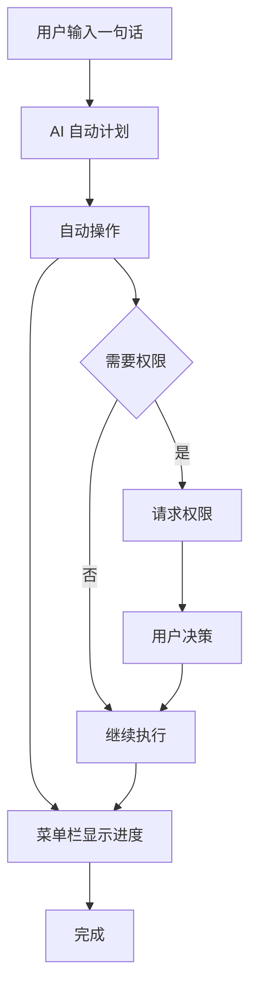
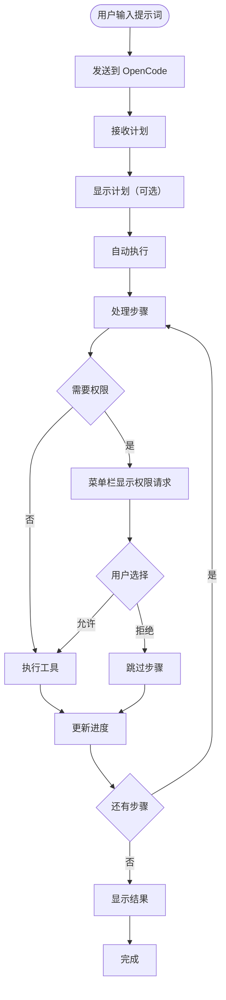

# OpenWork 处理流程图

## 核心流程

### 主流程



**核心流程**：
1. **用户输入一句话**：通过菜单栏输入提示词
2. **AI 自动计划**：OpenCode 生成执行计划（Todos）
3. **自动操作**：按计划自动执行步骤
4. **菜单栏显示进度**：实时显示任务进度和状态
5. **处理权限**：需要权限时请求用户决策

### 详细流程



## 核心设计逻辑

### 1. 一句话驱动
- **用户输入**：通过 macOS 菜单栏输入一句话（提示词）
- **AI 计划**：OpenCode 自动生成执行计划（Todos）
- **自动执行**：按计划自动执行，无需用户干预
- **进度显示**：在菜单栏实时显示任务进度

### 2. 权限处理
- **最小权限原则**：默认拒绝，需要明确授权
- **权限请求**：需要权限时在菜单栏显示请求
- **权限级别**：
  - **允许一次**：仅当前操作有效
  - **允许会话**：当前会话内有效
  - **始终允许**：持久授权，跨会话有效

### 3. 连接管理（支撑流程）
- **Host 模式**：启动本地 OpenCode 引擎
- **Client 模式**：连接到远程 OpenCode 服务器
- **工作区**：每个工作区对应一个文件夹路径

### 4. 会话管理（支撑流程）
- **会话 = 任务上下文**：每个会话对应一个任务
- **事件流**：通过 SSE 实时接收更新
- **会话隔离**：不同会话的状态和权限相互独立

### 5. 资源管理（支撑流程）
- **扩展**：Skills、Plugins、MCP
- **模板**：可重用的提示词模板

## 关键代码位置（Python 实现）

### 核心流程
- **输入处理**: `src/menubar/input.py` - 菜单栏输入处理
- **任务执行**: `src/task/executor.py` - `TaskExecutor` 类
- **进度显示**: `src/menubar/progress.py` - 菜单栏进度显示
- **权限处理**: `src/permission/manager.py` - `PermissionManager` 类

### 支撑流程
- **连接管理**: `src/client/opencode.py` - `OpenCodeClient` 类
- **会话管理**: `src/session/manager.py` - `SessionManager` 类
- **资源管理**: `src/extensions/manager.py` - `ExtensionsManager` 类

## 数据流

### 主数据流
```
用户输入 → AI 计划 → 自动执行 → 显示进度 → 完成
```

### 权限数据流
```
需要权限 → 菜单栏显示请求 → 用户决策 → 继续执行
```

## 状态管理

### 任务状态
- **运行中**：显示当前步骤和进度
- **等待权限**：显示权限请求
- **已完成**：显示结果摘要
- **已失败**：显示错误信息
